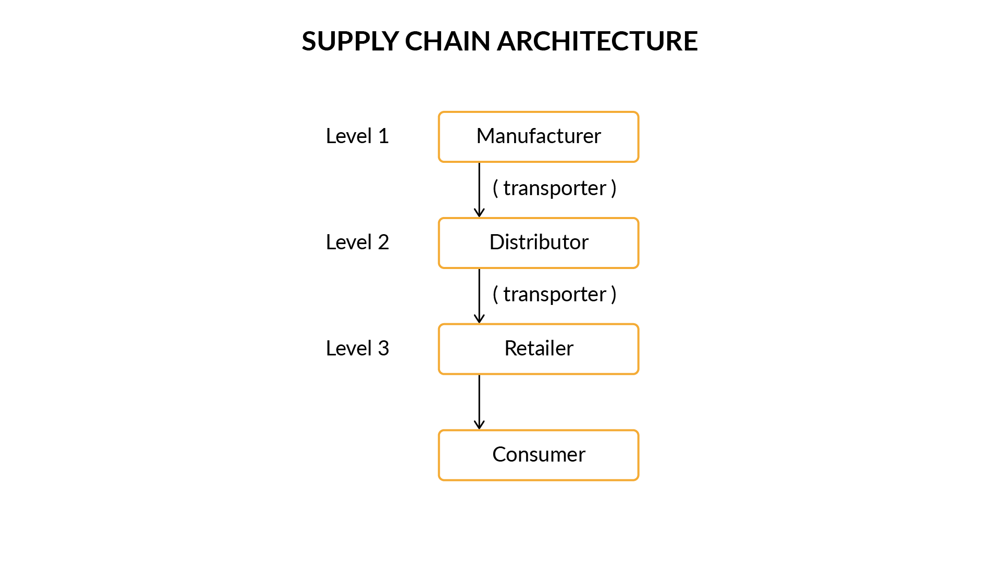

# pharma-network
A project for applying blockchain to tackle the challenge of drug-counterfeiting.

## Fabric Network
- 5 Organizations (Manufacturer, Distributor, Retailer, Consumer, Transporter)
- TLS Disabled
- 2 Peers per org
- 1 User per node (Only Admin)


## Network Architecture




As shown in the image above, there are five stakeholders/organisations in this supply chain network.

 

**1. Manufacturers:** All the drug manufacturers that are registered or will be registered in the future with the network will belong to this level. For example, companies like ‘Sun Pharma’ and ‘Dr. Reddy’s Laboratories’ that are drug manufacturing companies will be a part of the ‘Manufacturers’ organisation.

 

**2. Distributors:** All the drug distributors that are registered or will be registered in the future on the network will belong to this organisation. These distributors will purchase drugs directly from the manufacturers. For example, companies like ‘VG pharma’ and ‘Medico Labs’ would constitute drug distributors and be a part of the ‘Distributors’ organisation.

 

**3. Retailers:** All pharmacists or drug retailers will be a part of this organisation. The retailers will receive drug consignments from the distributors. 

 

**4. Consumers:** These are the people who purchase medicines from pharmacists. 

 

**5. Transporters:** A transporter is an entity that is responsible for the shipment of consignments from one point to another. For example, entities like Blue Dart or FedEx will serve as transporters to ship the drug consignments from Manufacturers to Distributors. Similarly, if a consignment has to be shipped from a Distributor to a Retailer, a transporter will be required. 


## Workflow
The workflow required for the case study is divided into the following four units:

 

### Company Registration: 
-   All the entities who wish to be part of the supply chain network must be first registered or, in other terms, stored on the ledger. 
### Drug Registration:
-   As a part of this process, any drug manufactured has to be registered on the ledger by the manufacturing company. 
### Transfer Drug:
-   A buyer of the product will raise a Purchase Order for a particular drug.
-   The Purchase Order will be generated for a batch of drugs. It will include information like the name of the drug, the quantity required, Buyer, etc.
-   Based on the Purchase Order, the seller of the drug will initiate the process of shipment of the drug with the help of a transporter company like ‘FedEx’, and a shipment object will be created.
-   The shipment object will contain information like, the name of the transporter, origin, destination, etc.
-   Once the consignment is received by the buyer, the buyer will become the new owner of each item of the batch. 
-   If the buyer is a consumer, then the Purchase Order and the shipment process need not be initiated. Only the owner of the drug is changed from the retailer to the consumer. 
### View Lifecycle: 
-   It is the process to view the lifecycle of the asset to date. 
-   Imagine a consumer or a retailer wishes to view the lifecycle of a drug called ‘amoxicillin’ with serial number ‘medi-001’. The ‘View Lifecycle’ functionality of the smart contract will allow any participant in the network to view the entire lifecycle of the asset.


## Network Setup

1. Pre-setup
    1. Generate Crypto Materials
		```console
        Rajesh GADIPARTHI >> $ cryptogen generate --config=./crypto-config.yaml
